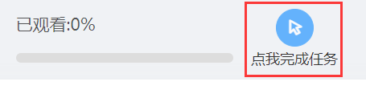
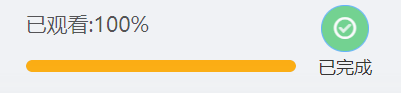

# Xiaoya-Video

小雅学习平台视频脚本（非全自动），之前瞎 jb 乱糊的，既然有需求就优化了下开源吧。

#### 脚本依赖

- Python 3.x
- Requests: `pip install requests`

#### 使用方式

1. **获取 Token**

PC 登录小雅平台，然后按 F12 打开浏览器调试工具，进入 Application (应用) 选项卡，然后在左侧菜单展开 Cookie，选择小雅的 Cookie，然后在列表中找到 `WT-prd-access-token`，复制它的值即可。

2. **启动程序**

`python .\main.py`

3. **输入 token**

程序会要求输入 Token，粘贴刚才复制的 `WT-prd-access-token` 的**值**后回车即可。

4. **输入 node_id**

在小雅中打开需要刷的视频的页面，然后复制链接的最后**一项数字**。

例如链接：`https://whut.ai-augmented.com/app/jx-web/mycourse/6386072145499282782/resource/6401746668911348814/6401746668902961130`

我们需要的数字是：`6401746668902961130`

然后将其粘贴进入程序回车即可

5. **手动点击按钮**

手动点击视频完成按钮，不用看视频就能立马完成啦（因为脚本给你刷了 1000 秒，如果真的有超过 1000 秒的视频那就多刷几次）

|  |      |
| -------------------------------------- | ---- |

6. **循环运行**

脚本会死循环一直运行，使用 Ctrl + C 中断（当然你可以直接叉了）