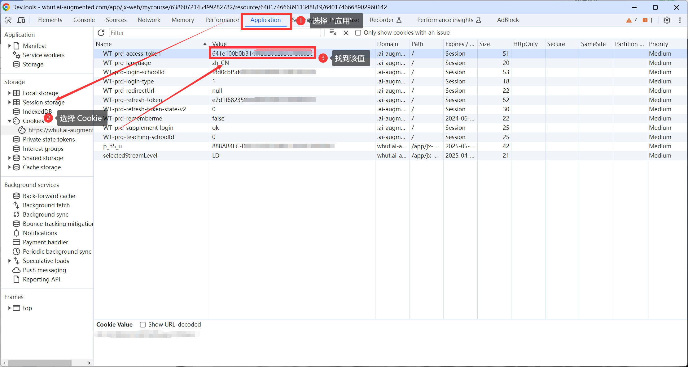

# Xiaoya-Script

小雅学习平台脚本，能够全自动完成文档 (type=6) 以及视频 (type=9) 类型的任务。

#### 脚本依赖

- Python 3.x
- Requests: `pip install requests`

#### 使用方式

1. **获取 Token**

PC 登录小雅平台，然后按 F12 打开浏览器调试工具，进入 Application (应用) 选项卡，然后在左侧菜单展开 Cookie，选择小雅的 Cookie，然后在列表中找到 `WT-prd-access-token`，复制它的值即可。

2. **启动程序**

`python .\main.py`

3. **输入 token**

程序会要求输入 Token，粘贴刚才复制的 `WT-prd-access-token` 的**值**后回车即可。

4. **输入 group_id**

在小雅中打开需要刷的课程的页面，然后复制链接的 `mycourse` 后的数字。

例如链接：`https://whut.ai-augmented.com/app/jx-web/mycourse/6386072187333281406/resource/6386072187937254761`

我们需要的数字是：`6386072187333281406`

然后将其粘贴进入程序回车即可，程序将会自动运行。